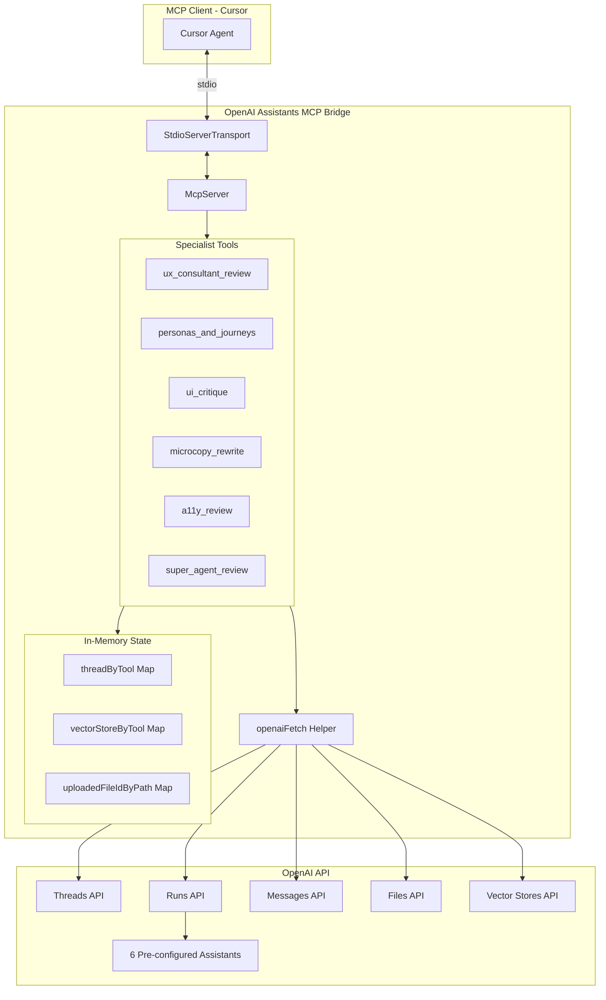

# OpenAI Assistants MCP Bridge

Get expert AI feedback on your product designs directly in Cursor. This tool connects Cursor to specialized OpenAI Assistants that can review your UX, UI, accessibility, and content.

## What Does This Do?

When you install this MCP (Model Context Protocol) server, you get access to six AI design experts inside Cursor:

| Expert | What They Help With |
|--------|---------------------|
| **UX Consultant** | Reviews user experience, identifies friction points, suggests improvements |
| **Personas & Journeys** | Helps define user personas and map user journeys |
| **UI Critique** | Reviews visual design - layout, typography, colors, spacing |
| **Microcopy Editor** | Improves button labels, error messages, tooltips, and other UI text |
| **Accessibility Reviewer** | Checks WCAG 2.2 compliance and accessibility issues |
| **Product Design Super-Agent** | Comprehensive review covering all of the above |

Each expert remembers your conversation, so you can have back-and-forth discussions about your designs.

---

## Quick Start

```bash
git clone https://github.com/ravidorr/openai-assistants-mcp-bridge.git
cd openai-assistants-mcp-bridge
npm install && npm run build
npm run create-assistants
```

The setup script handles everything: prompts for your API key, creates the assistants, and configures Cursor. Just restart Cursor when done.

---

## Detailed Setup Guide

### Prerequisites

- **Node.js 18+**: Download from [nodejs.org](https://nodejs.org/) (LTS version recommended)
- **OpenAI API key**: Get one from [platform.openai.com/api-keys](https://platform.openai.com/api-keys)
- **Cursor IDE**: Download from [cursor.sh](https://cursor.sh/)

### Step 1: Download and Build

```bash
git clone https://github.com/ravidorr/openai-assistants-mcp-bridge.git
cd openai-assistants-mcp-bridge
npm install
npm run build
```

### Step 2: Create Assistants and Configure Cursor

Run the setup script:

```bash
npm 
```

The script will:
1. Prompt for your OpenAI API key (if not already set via `OPENAI_API_KEY` environment variable)
2. Create all 6 AI assistants in your OpenAI account
3. Offer to automatically configure Cursor's `mcp.json` file

If you prefer manual configuration, the script will also display the JSON you can copy.

### Step 3: Restart Cursor and Start Using It!

In Cursor's chat, you can now ask the AI to use any of the design experts. Try these example prompts:

- "Use the UX consultant to review this login flow"
- "Ask the accessibility reviewer to check this form"
- "Get microcopy suggestions for these error messages"
- "Have the super agent do a full review of this dashboard design"

---

## Troubleshooting

### "Command not found: node"

Install Node.js from [nodejs.org](https://nodejs.org/) (LTS version).

### "Invalid API key" during setup

- Get a valid key from [platform.openai.com/api-keys](https://platform.openai.com/api-keys)
- Ensure your OpenAI account has billing enabled
- The key should start with `sk-`

### "API key validation failed"

The setup script validates your API key before creating assistants. If validation fails:
- Check your internet connection
- Verify the API key is correct and active
- Ensure your OpenAI account has available credits

### Tools not showing in Cursor

1. Verify `mcp.json` was configured (check `~/.cursor/mcp.json`)
2. Restart Cursor completely (quit and reopen)
3. Run `npm run create-assistants` again and choose to auto-configure

### The assistants aren't responding

1. Check that your OpenAI account has available credits
2. Verify the assistant IDs in `mcp.json` match your OpenAI account
3. Try restarting Cursor

---

## Updating an Assistant

Need to change an assistant's name or instructions? Use the update wizard:

```bash
npm run update-assistant
```

The wizard will:
1. Read your `mcp.json` and show a list of configured assistants
2. Let you select which assistant to update
3. Show current details and prompt for changes
4. Confirm before applying updates

Example:
```
========================================
  OpenAI Assistant Update Wizard
========================================

Found 6 assistants:

  1) UX Consultant
  2) Personas & Journeys
  3) UI Critique
  4) Microcopy Editor
  5) Accessibility Reviewer
  6) Super Agent
  7) Enter a different assistant ID manually

Select an assistant (1-7): 1

Fetching current assistant details...

Current Assistant:
  Name:  UX Consultant (Complex SaaS)
  Model: gpt-4o

Enter new name (press Enter to keep current):
Do you want to update the instructions? (y/N):
```

---

## Available Tools

Once connected, these tools are available in Cursor:

| Tool Name | What It Does |
|-----------|--------------|
| `ux_consultant_review` | Get UX feedback and recommendations |
| `personas_and_journeys` | Work on user personas and journey maps |
| `ui_critique` | Get visual design feedback |
| `microcopy_rewrite` | Improve UI text and copy |
| `a11y_review` | Check accessibility compliance |
| `super_agent_review` | Get comprehensive design feedback |
| `reset_all_specialists` | Start fresh conversations with all experts |
| `list_specialists_status` | See current session status |
| `check_openai_connection` | Verify the connection is working |

### Tool Options

When using any of the design expert tools, you can include:

| Option | Description |
|--------|-------------|
| `prompt` | Your question or what you want reviewed (required) |
| `context` | Additional background information |
| `files` | File paths to include in the review |
| `image_urls` | URLs of screenshots or mockups to review |
| `reset_thread` | Start a fresh conversation (forgets previous context) |
| `reset_files` | Clear previously uploaded files |

---

## For Developers

<details>
<summary>Click to expand development documentation</summary>

### Architecture



### Development Commands

```bash
# Build the project
npm run build

# Watch mode for development
npm run dev

# Run linting
npm run lint

# Fix auto-fixable lint issues
npm run lint:fix

# Format code with Prettier
npm run format

# Check formatting without writing
npm run format:check

# Run tests
npm test
```

### Pre-commit Hooks

This project uses [Husky](https://typicode.github.io/husky/) and [lint-staged](https://github.com/lint-staged/lint-staged) to run checks before each commit:

- **ESLint** - Lints and auto-fixes staged `.ts` and `.js` files
- **Prettier** - Formats staged files
- **Tests** - Runs the test suite

To skip hooks temporarily (not recommended):

```bash
git commit --no-verify -m "Your message"
```

### Project Structure

```
openai-assistants-mcp-bridge/
├── src/
│   ├── index.ts              # Main server entry point
│   ├── types.ts              # TypeScript type definitions
│   ├── constants.ts          # Configuration constants
│   └── utils/
│       ├── logger.ts         # Structured logging utility
│       └── retry.ts          # Retry with exponential backoff
├── scripts/
│   └── create-assistants.ts  # Script to create OpenAI Assistants
├── tests/
│   └── utils/
│       ├── logger.test.ts
│       └── retry.test.ts
├── dist/                     # Compiled JavaScript output
├── .husky/                   # Git hooks (pre-commit)
├── .env.example              # Environment variables template
├── .nvmrc                    # Node version for nvm users
├── .prettierrc               # Prettier configuration
├── assistants-creation.md    # Detailed assistant configurations
├── eslint.config.js          # ESLint configuration
├── package.json
├── tsconfig.json             # TypeScript config (includes all files)
├── tsconfig.build.json       # TypeScript config for production build
├── vitest.config.ts          # Test configuration
└── README.md
```

### Environment Variables

| Variable | Required | Default | Description |
|----------|----------|---------|-------------|
| `OPENAI_API_KEY` | Yes | - | Your OpenAI API key |
| `OPENAI_ASSISTANT_UX` | Yes | - | Assistant ID for UX consultant |
| `OPENAI_ASSISTANT_PERSONAS` | Yes | - | Assistant ID for personas/journeys |
| `OPENAI_ASSISTANT_UI` | Yes | - | Assistant ID for UI critique |
| `OPENAI_ASSISTANT_MICROCOPY` | Yes | - | Assistant ID for microcopy |
| `OPENAI_ASSISTANT_A11Y` | Yes | - | Assistant ID for accessibility |
| `OPENAI_ASSISTANT_SUPER` | Yes | - | Assistant ID for super agent |
| `OPENAI_BASE_URL` | No | `https://api.openai.com/v1` | OpenAI API base URL |
| `OPENAI_POLL_TIMEOUT_MS` | No | `90000` | Max wait time for responses (ms) |
| `LOG_LEVEL` | No | `info` | Log level (debug, info, warn, error) |
| `LOG_ENABLED` | No | `true` | Enable/disable logging |

### Logging

The server outputs structured JSON logs to stderr. Example:

```json
{"timestamp":"2024-01-15T10:30:00.000Z","level":"info","message":"Tool invoked","context":{"toolName":"ux_consultant_review"}}
```

### Error Handling

- **Retry Logic**: Transient errors (429, 500, 503) are automatically retried with exponential backoff
- **Graceful Shutdown**: SIGTERM/SIGINT handlers ensure clean server shutdown
- **File Validation**: File paths are validated to prevent directory traversal attacks

</details>

---

## Learn More

- [Detailed Assistant Configurations](./assistants-creation.md) - Full prompts and settings for each AI expert
- [OpenAI Assistants API](https://platform.openai.com/docs/assistants/overview) - Official OpenAI documentation
- [Model Context Protocol](https://modelcontextprotocol.io/) - Learn about MCP

## License

MIT
