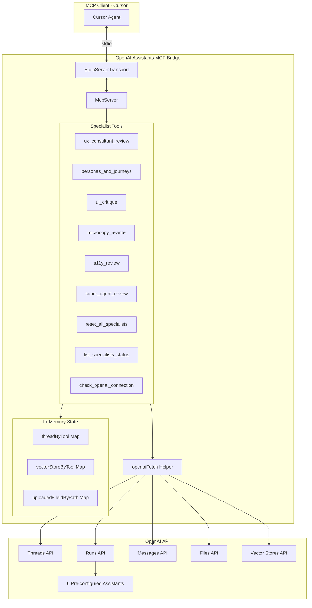

# OpenAI Assistants MCP Bridge

An MCP (Model Context Protocol) server that bridges MCP clients (like Cursor) to OpenAI's Assistants API. This enables AI coding assistants to leverage specialized OpenAI Assistants for UX review, UI critique, accessibility analysis, and more.

## Architecture



## Features

- **6 Specialist Tools**: Each tool connects to a dedicated OpenAI Assistant
  - `ux_consultant_review` - UX design review and recommendations
  - `personas_and_journeys` - User persona and journey analysis
  - `ui_critique` - Visual UI design critique
  - `microcopy_rewrite` - Copy and content improvement
  - `a11y_review` - Accessibility audit and WCAG compliance
  - `super_agent_review` - Comprehensive multi-aspect review

- **Conversation Persistence**: Each tool maintains its own thread for context continuity
- **File Search**: Upload files to vector stores for RAG-powered analysis
- **Robust Error Handling**: Retry logic with exponential backoff
- **Configurable**: Timeout, base URL, and logging via environment variables
- **Observability**: Structured JSON logging and health check endpoint

## Prerequisites

- Node.js >= 18.0.0
- OpenAI API key with Assistants API access
- 6 pre-configured OpenAI Assistants (one for each specialist)

## Installation

```bash
# Clone the repository
git clone <repository-url>
cd openai-assistants-mcp-bridge

# Install dependencies
npm install

# Build the project
npm run build
```

## Configuration

### Quick Setup

```bash
# Copy the example environment file
cp .env.example .env

# Edit .env with your values
nano .env  # or use your preferred editor
```

The server automatically loads environment variables from a `.env` file in the project root.

### Required Environment Variables

| Variable | Description |
|----------|-------------|
| `OPENAI_API_KEY` | Your OpenAI API key |
| `OPENAI_ASSISTANT_UX` | Assistant ID for UX consultant |
| `OPENAI_ASSISTANT_PERSONAS` | Assistant ID for personas/journeys |
| `OPENAI_ASSISTANT_UI` | Assistant ID for UI critique |
| `OPENAI_ASSISTANT_MICROCOPY` | Assistant ID for microcopy |
| `OPENAI_ASSISTANT_A11Y` | Assistant ID for accessibility |
| `OPENAI_ASSISTANT_SUPER` | Assistant ID for super agent |

### Optional Environment Variables

| Variable | Default | Description |
|----------|---------|-------------|
| `OPENAI_BASE_URL` | `https://api.openai.com/v1` | OpenAI API base URL |
| `OPENAI_POLL_TIMEOUT_MS` | `90000` | Max time to wait for assistant response |
| `LOG_LEVEL` | `info` | Minimum log level (debug, info, warn, error) |
| `LOG_ENABLED` | `true` | Enable/disable logging |

### Example `.env` File

```bash
# Required
OPENAI_API_KEY=sk-your-api-key-here

# Assistant IDs (get these from OpenAI platform)
OPENAI_ASSISTANT_UX=asst_xxxxxxxxxxxxx
OPENAI_ASSISTANT_PERSONAS=asst_xxxxxxxxxxxxx
OPENAI_ASSISTANT_UI=asst_xxxxxxxxxxxxx
OPENAI_ASSISTANT_MICROCOPY=asst_xxxxxxxxxxxxx
OPENAI_ASSISTANT_A11Y=asst_xxxxxxxxxxxxx
OPENAI_ASSISTANT_SUPER=asst_xxxxxxxxxxxxx

# Optional configuration
OPENAI_POLL_TIMEOUT_MS=120000
LOG_LEVEL=debug
```

See `.env.example` for a complete template with all available options.

## Usage

### Running the Server

```bash
# Start the MCP server
npm start

# Or run directly
node dist/index.js
```

### Cursor Integration

Add this to your Cursor MCP settings (`.cursor/mcp.json`):

```json
{
  "mcpServers": {
    "openai-assistants-bridge": {
      "command": "node",
      "args": ["/path/to/openai-assistants-mcp-bridge/dist/index.js"],
      "env": {
        "OPENAI_API_KEY": "sk-your-api-key",
        "OPENAI_ASSISTANT_UX": "asst_xxx",
        "OPENAI_ASSISTANT_PERSONAS": "asst_xxx",
        "OPENAI_ASSISTANT_UI": "asst_xxx",
        "OPENAI_ASSISTANT_MICROCOPY": "asst_xxx",
        "OPENAI_ASSISTANT_A11Y": "asst_xxx",
        "OPENAI_ASSISTANT_SUPER": "asst_xxx"
      }
    }
  }
}
```

## Tool Reference

### Specialist Tools

All specialist tools share the same input schema:

| Parameter | Type | Required | Description |
|-----------|------|----------|-------------|
| `prompt` | string | Yes | The request/content to send to the assistant |
| `context` | string | No | Additional context (constraints, criteria, etc.) |
| `files` | string[] | No | Local file paths to upload for file search |
| `reset_thread` | boolean | No | Start a fresh conversation thread |
| `reset_files` | boolean | No | Clear the tool's vector store |

### Utility Tools

#### `reset_all_specialists`

Reset all threads and vector stores for all specialists.

| Parameter | Type | Default | Description |
|-----------|------|---------|-------------|
| `confirm` | boolean | true | Confirm the reset action |

#### `list_specialists_status`

Get current status of all specialists including active threads, vector stores, and configuration.

#### `check_openai_connection`

Health check to verify OpenAI API connectivity and measure latency.

## Development

```bash
# Build the project
npm run build

# Watch mode for development
npm run dev

# Run linting (when configured)
npm run lint

# Run tests (when configured)
npm test
```

## Project Structure

```
openai-assistants-mcp-bridge/
├── src/
│   ├── index.ts          # Main server entry point
│   ├── types.ts          # TypeScript type definitions
│   ├── constants.ts      # Configuration constants
│   └── utils/
│       ├── logger.ts     # Structured logging utility
│       └── retry.ts      # Retry with exponential backoff
├── tests/
│   └── utils/
│       ├── logger.test.ts
│       └── retry.test.ts
├── dist/                 # Compiled JavaScript output
├── .env.example          # Environment variables template
├── package.json
├── tsconfig.json
├── vitest.config.ts      # Test configuration
└── README.md
```

## Logging

The server outputs structured JSON logs to stderr (to avoid interfering with MCP's stdio transport). Example:

```json
{"timestamp":"2024-01-15T10:30:00.000Z","level":"info","message":"Tool invoked","context":{"toolName":"ux_consultant_review","hasContext":true,"fileCount":2}}
```

## Error Handling

- **Retry Logic**: Transient errors (429, 500, 503) are automatically retried with exponential backoff
- **Graceful Shutdown**: SIGTERM/SIGINT handlers ensure clean server shutdown
- **File Validation**: File paths are validated to prevent directory traversal attacks

## License

MIT
